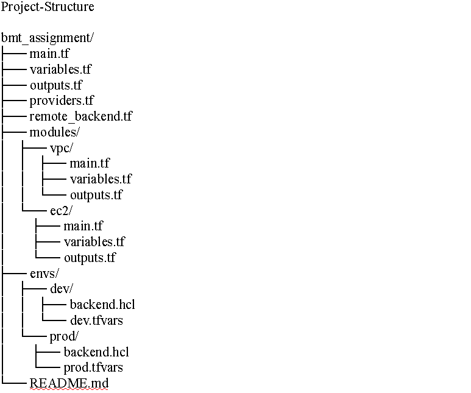

# Junior-Intermidiate Cloud Engineer Home Assignment
Please, read About.md file in the root project before you proceed
```bash
https://github.com/rayeeta/publiq_project/blob/master/About.md
```

This repository contains Terraform code to provision a simple web application infrastructure in AWS with support for two environments (dev and prod).

## Project Strucutre



## Prerequisites

- AWS CLI installed and configured
- Terraform installed (v1.0.0 or newer)
- Your public IP address (for security group rules)

## Deployment Instructions

### 1. Create S3 Buckets and DynamoDB Tables for Remote State

First, deploy the infrastructure for the Terraform remote state:

```bash
# Initialize Terraform (local state)
terraform init

Apply only the remote backend setup

Dev environment
terraform apply terraform init -backend-config=envs/dev/backend.hcl
terraform apply -var-file=envs/dev/dev.tfvars

Prod environment
terraform apply terraform init -backend-config=envs/prod/backend.hcl
terraform apply -var-file=envs/prod/prod.tfvars

To very if the webserver is running in your browser, copy and paste the public_ip of the ec2_instance
http://<your_ec2_public_ip> and hit ENTER on your keyboard.

Make sure to destroy all the created resources with the following command

Dev 
terraform destroy -var-file=envs/dev/dev.tfvars

Prod
terraform destroy -var-file=envs/prod/prod.tfvars

